# Hardware-Projects-Overview
## Documenting My Journey Learning PCB Design 
## *No information, schematics, firmware, software, or advice in these projects are intended for medical, or clinical use or for use in critical applications. These tools should not be used to treat and or diagnose any disease or medical condition.*

# Multichannel Precision Thermocouple Interface with Isolated RS 485 and 2 Channel (Bidirectional, Unidirectional) Isolated TEC Driver (In-Progress) *
PCB contains six channel K-type thermocouple inputs (PCC-SMP-V-K) with internal cold junction compensation through the AFE and A/D ICs. External flash for data logging and configuration. STM32F4 for processing and throughput over USB 2.0 FS. Dual architecture drivers for thermoelectric coolers, and galvanically isolated power electronics sections, with H-bridge and PMBUS controlled buck converter. External TMP117 for temperature reference. External voltage reference for ADC. Isolated current sense, internal and Hall effect. Peltier surface temperature control loop via thermocouple inputs. PCB stackup: SIG-GND-GND-SIG for signal integrity.

# Open Source Kinetic Imager Lite (OSKI Lite) *
Multispectral imaging module containing inputs for a visible light and LWIR imager (FLIR Lepton). Contains temperature, barometer, IMU, ToF, ambient light sensors. QSPI flash, communications over USB 2.0 HS with external PHY, STM32H743 for video frame processing and throughput. Power sequencing for imagers. 6 layer PCB stackup -> SIG-GND-SIG-PWR-GND-SIG

# Compact Pulse Oximeter and Sensor USB Interface (In Progress) *
Compact 60x30 mm sensor board in order to evaluate various sensors include a max 30102 pulse oximeter, max 30205 temperature sensor, mems microphone, bmi 323 IMU, apds-9306 ambient light sensor. Separate LDOs for analog and digital supply rails. Command and control planned via USB CDC through an STM32F411 to enable analysis and plotting of heart rate, IMU, SpO2 data. PCB stackup: SIG-GND-GND-SIG for signal integrity.

##
## The following projects are UNTESTED proofs of concepts and are not currently planned (perhaps in the future) to be manufactured but pass the configured PCB design and manufacturing rule checks, but have not been electrically validated

# Highly Integrated Cellular PCB
LTE capable cellular device with several peripherals and LCD display. Includes GNSS for geotagging capability. Audio codec IC with built in speaker and microphone front-end, interfaces via I2S. High reliability LARA-R6 module with diversity improves cellular link range and performance in difficult environments. Peripherals include button matrix for input selection, magnetometer, IMU, SD and NANO Sim card interfaces, barometric pressure, gas detection (VOC), humidity, temperature, battery monitoring and charging IC, haptic motor driver, optical ambient sensor, and on board QSPI serial and NAND flash and SDRAM. Contains an STM32H7 for audio and digital processing and for interfacing with the RF modules, in addition, an auxiliary STM32F4 MCU that handles the user interface and on board sensors. Currently reworking the power supply to enable solar input. 6 layer PCB stackup -> SIG-GND-SIG-PWR-GND-SIG/PWR

Click image to zoom in.
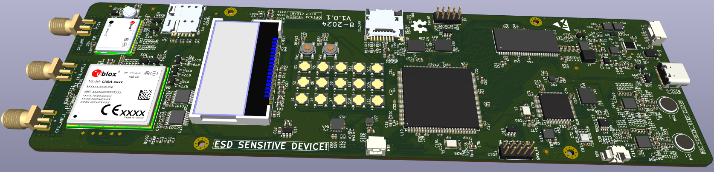
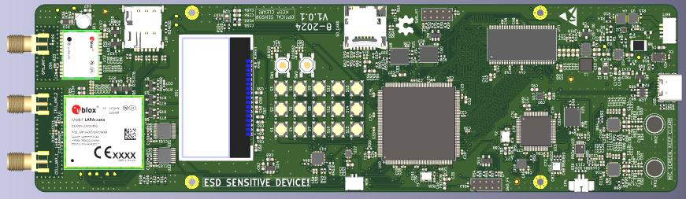
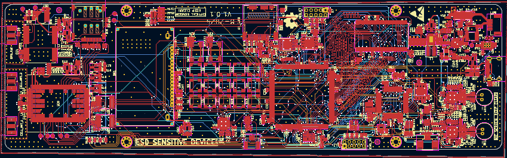

# sUAS Flight Controller PCB with Solar Charging + Environmental Monitoring Prototype 
1S Short range micro drone flight controller: utilizes an STM32F4 MCU, IMU (BMI270), barometric pressure (BMP390) and magnetometer sensors, on-board MPPT solar harvesting IC, GNSS (ZOE-M8Q), gas detection, temperature, and humidity sensors (BME680) and TI cc2500 2.4 GHz transceiver. Solar system enables charging for remote/autonomous usage, allowing the UAS to land and slowly charge and continue to operate and send telemetry without swapping batteries. The panel does not intend to power the drone directly, but serve as a charger for the battery. On board 128MBit flash "black box" for data logging. PWM motor outputs for initial testing, ESCs are off-board and are connected to the battery via an external power delivery board. Note: requires additional testing to verify if power path enabled charging ICs may detect a fault and disconnect the battery from the system leading to failure of the flight computer when drawing high currents to power the motors due to voltage drop. For longer range applications, requires PA/LNA, recommended: TI cc2592. Future Development: FPGA for image processing and a vtx IC, a more powerful transceiver for longer range (LEO satellite communications module for global range), optimize connectors and reduce component count for weight. USB-C and panel max charge current 1.5A. Tiny 62 x 56 mm form factor! 6 layer PCB stackup -> SIG-GND-SIG-PWR-GND-SIG

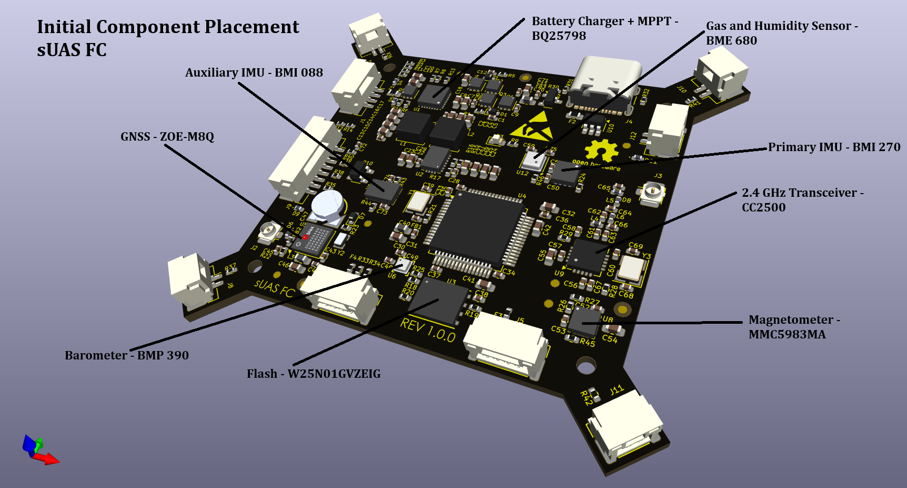
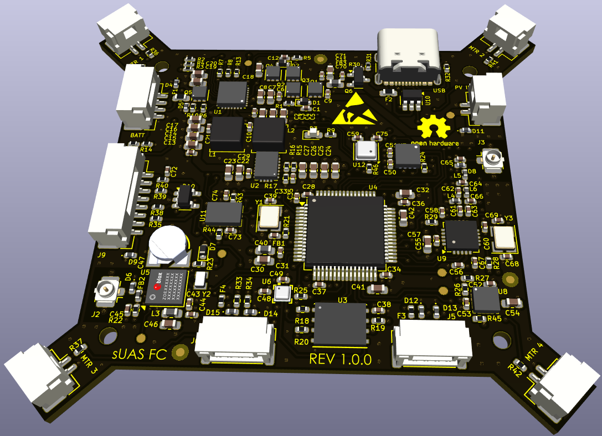
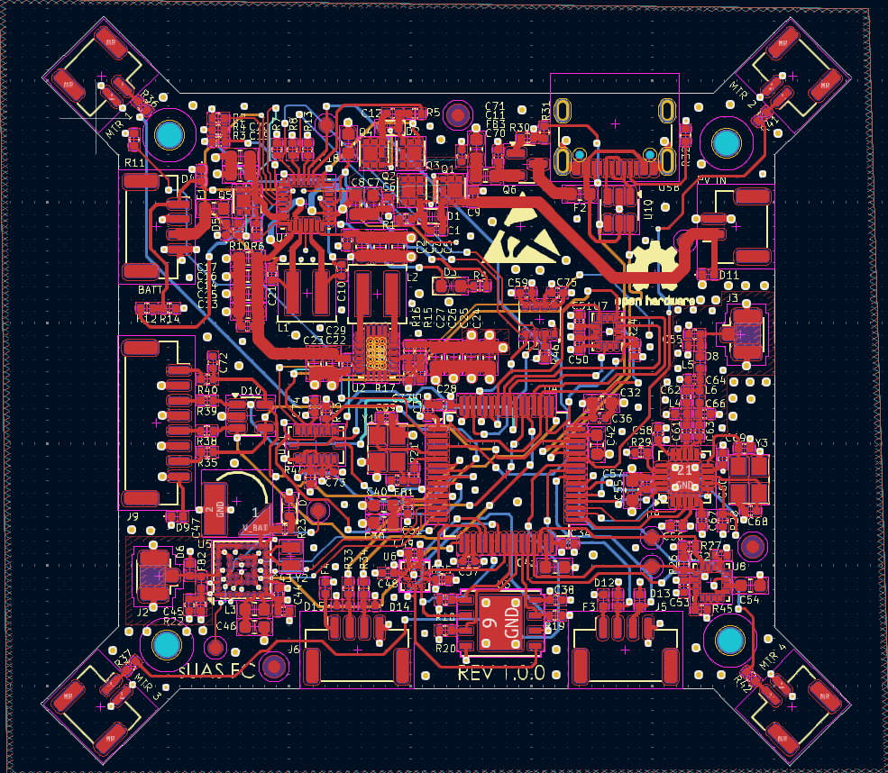

# Compact Low Power Physiological Sensor Board (In Progress) *
Compact 30mm diameter (version 1) form factor biomedical sensor array for wearable applications, with STM32U585 low power MCU, heart rate measurement, SpO2 (pulse oximeter), inertial measurement unit, and body temperature sensor. This design focuses on solving the size constraints of previous GPS enabled modules by using a GNSS module with a built in antenna for a compact application. This board serves as a processing board for connection with a power delivery and management carrier board via a Molex high reliability SlimStack connector. Double sided PCB with GNSS active antenna on the back. The carrier board contains battery protection and charging IC, DC-DC converter, TI cc2500 2.4 GHz transceiver, USB and SWD interface (version 1). 

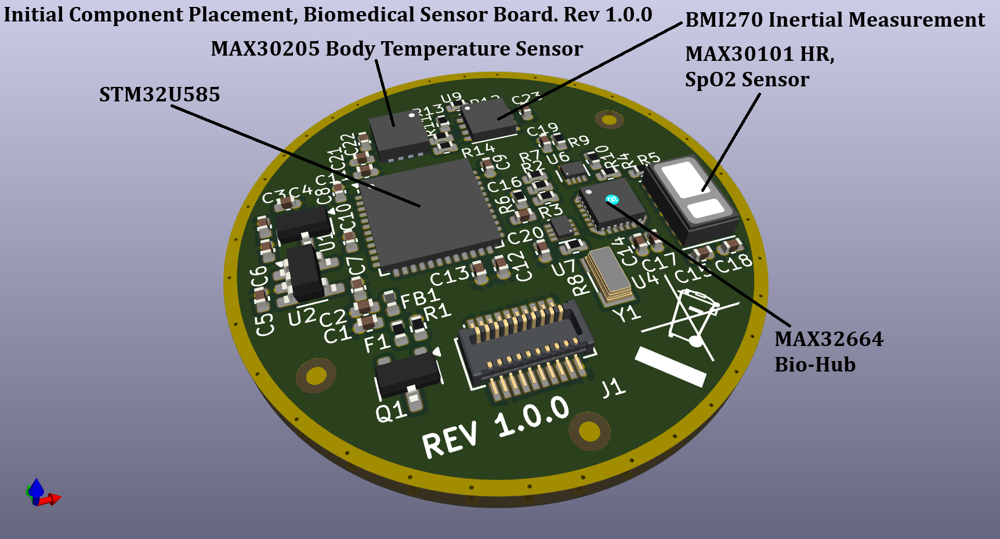

# LTE-Enabled GNSS Tracking and Reporting Device
Utilizes ublox LARA-R6 multi-mode LTE Cat 1 module and NEO-GNSS modules for remote tracking. Includes ICs for battery protection, temperature monitoring, charging, power path for mobile operations. Ublox LARA features jamming detection and reliability features that can be interfaced with the MCU (future note for firmware development). Configured MCU pins for shutdown and low power operation to conserve battery consumption while on standby. Contains IMU for motion sensing. Stackup -> SIG-GND-GND-SIG/PWR

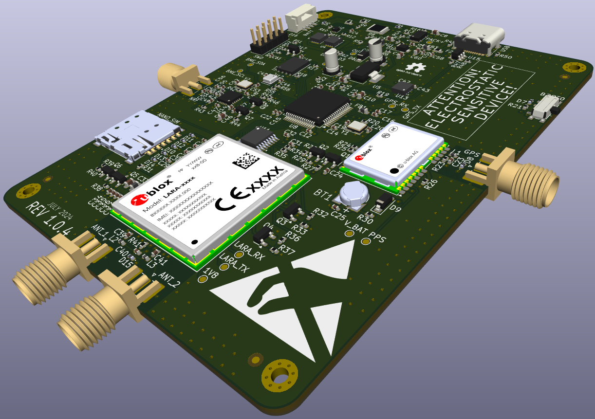 
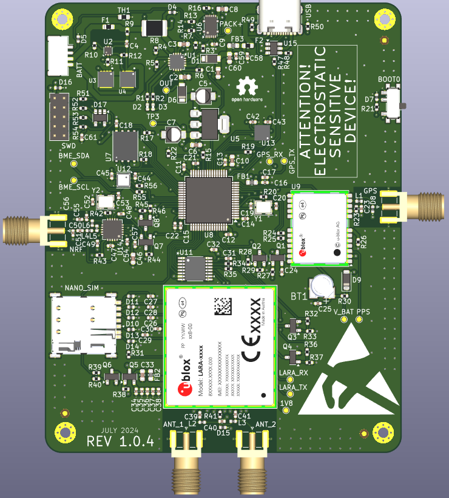
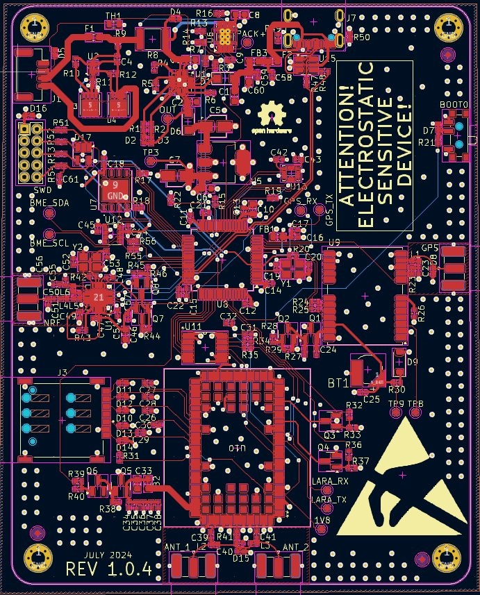

# Portable Health Monitoring PCB 
Utilizes photoplethysmography, SpO2, heart rate, blood pressure estimation, temperature, barometric pressure, gas detection (VOC), humidity and IMU sensors. Includes 2.4 GHz transceiver and NEO GNSS module for geotagging capability. Update: Possibly requires bi-directional level shifting for I2C and control pins of the bio-hub IC, requires further evaluation before implementing.
Utlizes STM32F4 microcontroller and external flash for powerful and robust operation. SIG-GND-GND-PWR layer stackup for signal integrity.

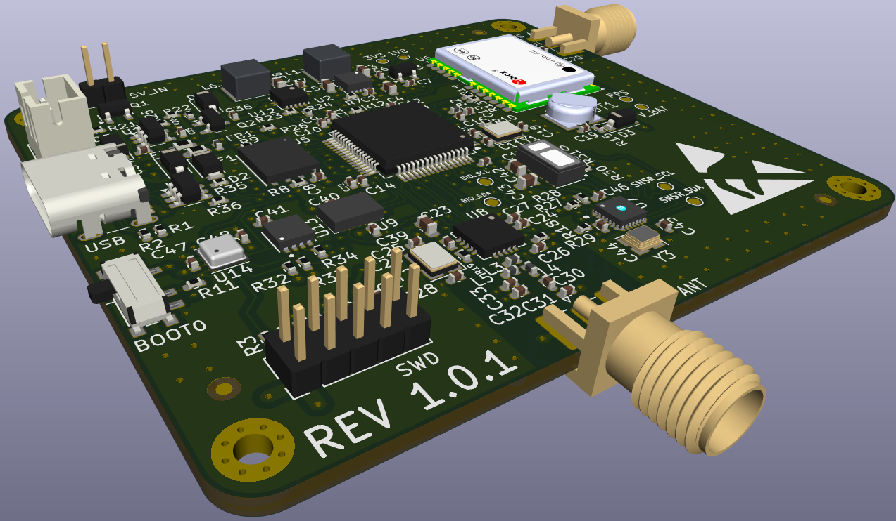 
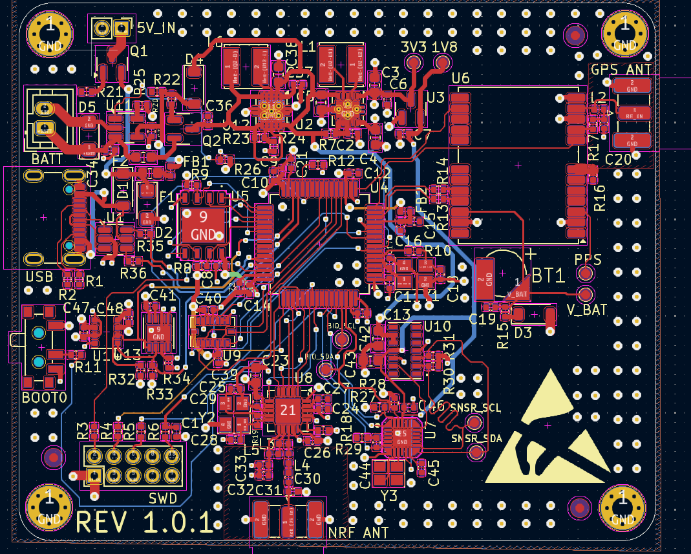

# Extensible STM32 Wireless Data Storage System on Module 
Memory module with wireless data transfer capability for testing RF projects and localized data storage. Utilizes several NAND flash ICs that communicate over SPI to an STM32F4 microcontroller, utilizes a PCIe style connector (does not utilize PCIe protocols for this module). Plan for data replication for redundancy.  

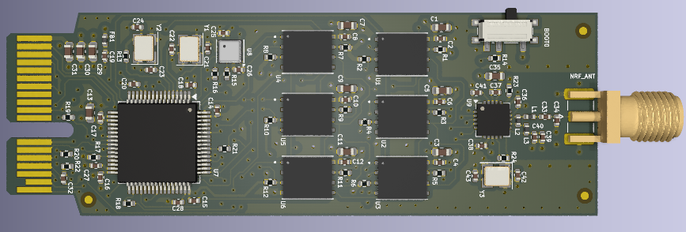

# Arduino Nano Every Based Development Board with I2C Multiplexer (In Progress)
Designed to solve the challenges with the lack of I2C available pins on the board, and allow for the easy integration of sensors utilizing different logic levels with built in logic level conversion in the multiplexer IC. Routing, component placement in progress.

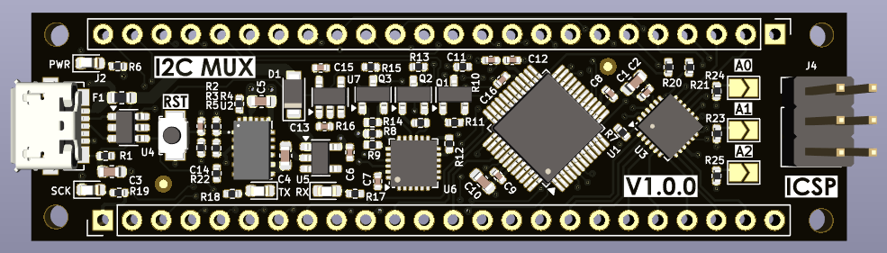

---------------------------------------------------------------------------------------------------------------------------------------------------------------------------------------------------------------------------
"*" Indicates that PCBs have been manufactured and are either undergoing assembly, firmware development, or testing
Gerber and manufacturing files available upon request, all schematics are available in each project directory. These designs are independent undergraduate hardware projects and are for reference only and are still prototypes, no device shown is claimed to be a medical device. 
As always, any and all feedback is welcome and appreciated, especially for inaccuracies or errors.
