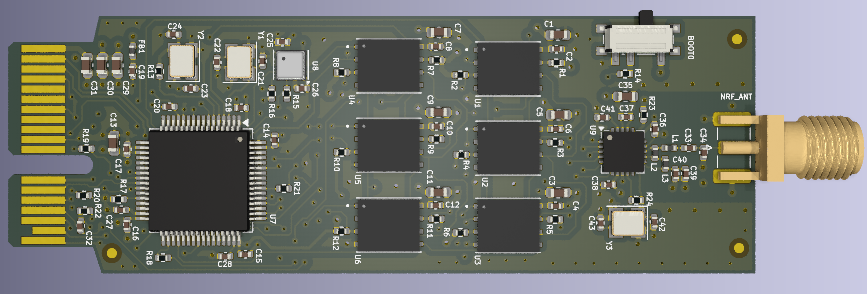

# Hardware-Projects
## Documenting My Journey Learning PCB Design 

# Highly Integrated Cellular PCB
LTE capable cellular device with several peripherals and LCD display. Includes GNSS for geotagging capability. Audio codec IC with built in speaker and microphone front-end, interfaces via I2S. High reliability LARA-R6 module with diversity ensures excellent range and performance in difficult environments. Peripherals include button matrix for input selection, magnetometer, IMU, SD and NANO Sim card interfaces, barometric pressure, gas detection (VOC), humidity, temperature, battery monitoring and charging IC, haptic motor driver, optical ambient sensor, and on board QSPI serial and NAND flash and SDRAM. Contains an STM32H7 for audio and digital processing and for interfacing with the RF modules, in addition, an auxiliary STM32F4 MCU that handles the user interface and on board sensors. Currently reworking the power supply to enable solar input. 6 layer PCB stackup -> SIG-GND-SIG-PWR-GND-SIG/PWR

Click image to zoom in.

# sUAS Flight Controller PCB with Solar Charging + Environmental Monitoring Prototype 
1S Short range micro drone flight controller: utilizes an STM32F4 MCU, IMU (BMI270), barometric pressure (BMP390) and magnetometer sensors, on-board MPPT solar harvesting IC, GNSS (ZOE-M8Q), gas detection, temperature, and humidity sensors (BME680) and TI cc2500 2.4 GHz transceiver. Solar system enables charging for remote/autonomous usage, allowing the UAS to land and slowly charge and continue to operate and send telemetry without swapping batteries. The panel does not intend to power the drone directly, but serve as a charger for the battery. On board 128MB flash "black box" for data logging. PWM motor outputs for initial testing, ESCs are off-board and are connected to the battery via an external power delivery board. Note: requires additional testing to verify if power path enabled charging ICs may detect a fault and disconnect the battery from the system leading to failure of the flight computer when drawing high currents to power the motors due to voltage drop. For longer range applications, requires PA/LNA, recommended: TI cc2592. Future Development: FPGA for image processing and a vtx IC, a more powerful transceiver for longer range (LEO satellite communications module for global range), optimize connectors and reduce component count for weight. USB-C and panel max charge current 1.5A. Tiny 62 x 56 mm form factor! 6 layer PCB stackup -> SIG-GND-SIG-PWR-GND-SIG

# LTE-Enabled GNSS Tracking and Reporting Device
Utilizes ublox LARA-R6 multi-mode LTE Cat 1 module and NEO-GNSS modules for remote tracking. Includes ICs for battery protection, temperature monitoring, charging, power path for mobile operations. Ublox LARA features jamming detection and reliability features that can be interfaced with the MCU (future note for firmware development). Configured MCU pins for shutdown and low power operation to conserve battery consumption while on standby. Contains IMU for motion sensing. Stackup -> SIG-GND-GND-SIG/PWR

 

# Portable Remote Patient Monitoring PCB 
Utilizes photoplethysmography, SpO2, heart rate, blood pressure estimation, temperature, barometric pressure, gas detection (VOC), humidity and IMU sensors to remotely monitor patient health and status. Includes 2.4 GHz transceiver and NEO GNSS module for geotagging capability. Update: Possibly requires bi-directional level shifting for I2C and control pins of the bio-hub IC, requires further evaluation before implementing.
Utlizes STM32F4 microcontroller and external flash for powerful and robust operation. SIG-GND-GND-PWR layer stackup for signal integrity.

 

# Extensible STM32 Wireless Data Storage System on Module 
Memory module with wireless data transfer capability for testing RF projects and localized data storage. Utilizes several NAND flash ICs that communicate over SPI to an STM32F4 microcontroller, utilizes a PCIe style connector (does not utilize PCIe protocols for this module). Plan for data replication for redundancy.  

# Compact Low Power Biomedical Sensor Board (In Progress)
Compact 30mm diameter form factor biomedical sensor array for wearable applications, with STM32U585 low power MCU, blood pressure estimation IC, heart rate measurement, SpO2 (pulse oximeter), inertial measurement unit, and medical grade temperature sensor. This design focuses on solving the size constraints of previous GPS enabled modules by using a GNSS module with a built in antenna for a compact application. This board serves as a processing board for connection with a power delivery and management carrier board via a Molex high reliability SlimStack connector. Double sided PCB with GNSS active antenna on the back. The carrier board contains battery protection and charging IC, DC-DC converter, TI cc2500 2.4 GHz transceiver, USB and SWD interface. 

# Arduino Nano Every Based Development Board with I2C Multiplexer (In Progress)
Designed to solve the challenges with the lack of I2C available pins on the board, and allow for the easy integration of sensors utilizing different logic levels with built in logic level conversion in the multiplexer IC. Routing, component placement in progress.

---------------------------------------------------------------------------------------------------------------------------------------------------------------------------------------------------------------------------
Gerber and manufacturing files available upon request, all schematics are available in each project directory. DISCLAIMER!!! I AM NOT AN ENGINEER, yet :) , these designs are for reference only and are still prototypes, firmware development planned at a later time**
As always, any and all feedback is welcome and appreciated.
